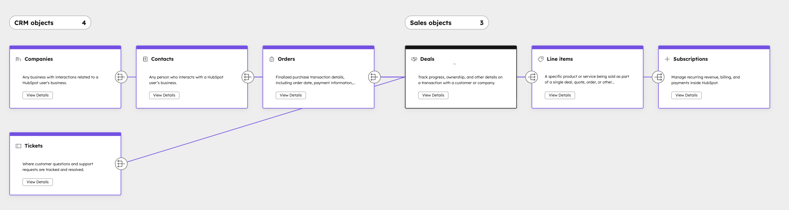

# HubSpot CRM Integration with AI - Breezy Technical Assessment

A full-stack proof of concept demonstrating HubSpot CRM integration with an AI-powered chat assistant for e-commerce operations. This project showcases how Breezy can leverage HubSpot's CRM capabilities with intelligent automation.

---

## Table of Contents

1. [Setup Instructions](#setup-instructions)
2. [Project Overview](#project-overview)
3. [AI Usage Documentation](#ai-usage-documentation)
4. [HubSpot Data Architecture](#hubspot-data-architecture)
5. [AI Feature Explanation](#ai-feature-explanation)
6. [Design Decisions](#design-decisions)
7. [Testing the Integration](#testing-the-integration)

---

## Setup Instructions

### Prerequisites

- **Node.js** v14 or higher
- **npm** or yarn package manager
- **Free HubSpot Account** ([Sign up here](https://offers.hubspot.com/free-trial))
- **OpenAI API Key** ([Get here](https://platform.openai.com/api-keys))


### Step 1: Get Your HubSpot Access Token

1. Sign in to your [HubSpot account](https://app.hubspot.com/)
2. Navigate to **Settings** → **Integrations** → **Private apps**
3. Click **Create app**
4. Give it a name (e.g., "Breezy CRM Assistant")
5. Go to the **Scopes** tab and enable:
   - `crm.objects.contacts.read`
   - `crm.objects.contacts.write`
   - `crm.objects.deals.read`
   - `crm.objects.deals.write`
6. Click **Create app** and copy your **access token**

### Step 2: Get Your OpenAI API Key

1. Visit [OpenAI Platform](https://platform.openai.com/)
2. Sign in or create an account
3. Navigate to **API keys**
4. Click **Create new secret key**
5. Copy your API key

### Step 3: Configure Environment Variables

#### Backend Setup

```bash
cd backend
cp .env.example .env
```

Edit `backend/.env`:

```env
HUBSPOT_ACCESS_TOKEN=pat-na1-xxxxxxxxxxxxx
OPENAI_API_KEY=sk-xxxxxxxxxxxxxxxxxxxxx
```

#### Frontend Setup

No additional configuration needed

### Step 4: Install Dependencies & Start Application

**Terminal 1 - Start Backend Server:**

```bash
cd backend
npm install
npm run dev
```

Expected output:
```
✅ Server running successfully!
🌐 API available at: http://localhost:3001
📋 Health check: http://localhost:3001/health
```

**Terminal 2 - Start Frontend Application:**

```bash
cd frontend
npm install
npm start
```

Expected output:
```
Compiled successfully!
You can now view frontend in the browser.
Local: http://localhost:3000
```

### Step 5: Access the Application

Open your browser and navigate to: **http://localhost:3000**

You should see the Breezy  Admin Panel with:
- AI Chat Assistant
- Contact List (with access to hubspot embed)
- Create Contact Form
- Deal List
- Create Deal Form(with access to hubspot embed)


---

## Testing the Integration Flow

### Manual Testing with cURL

#### 1. Check Backend Health


#### 1. Check Backend Health
```bash
curl http://localhost:3001/health
```

#### 2. Fetch All Contacts
```bash
curl http://localhost:3001/api/contacts
```

#### 3. Create a New Contact
```bash
curl -X POST http://localhost:3001/api/contacts \
  -H "Content-Type: application/json" \
  -d '{
    "properties": {
      "firstname": "Jane",
      "lastname": "Doe",
      "email": "jane@breezy.com",
      "phone": "555-0123",
      "company": "Breezy Inc"
    }
  }'
  ```

#### 4. Get a Single Contact by ID 
```bash
curl http://localhost:3001/api/contacts/:contactId
```

#### 5. Create a Deal Associated with Contact (replace 12345 with actual contact ID)
```bash
curl -X POST http://localhost:3001/api/deals \
  -H "Content-Type: application/json" \
  -d '{
    "dealProperties": {
      "dealname": "Breezy Premium - Annual",
      "amount": "99.99",
      "dealstage": "closedwon"
    },
    "contactId": "12345"
  }'
```

#### 6. Get All Deals
```bash
curl http://localhost:3001/api/deals
```

#### 7. Get a Single Deal by ID 
```bash
curl http://localhost:3001/api/deals/:dealId
```

#### 8. Get Deals for a Specific Contact (replace 12345 with actual contact ID)
```bash
curl http://localhost:3001/api/contacts/:contactId/deals
```

#### 9. Get Contacts Associated with a Deal (replace 67890 with actual deal ID)
```bash
curl http://localhost:3001/api/deals/:dealId/contacts
```

#### 10. Test AI Chat - Query Contacts
```bash
curl -X POST http://localhost:3001/api/chat \
  -H "Content-Type: application/json" \
  -d '{
    "messages": [
      {
        "role": "user",
        "content": "What contacts do we have in the system?"
      }
    ]
  }'
```

### Browser-Based Testing

1. **View Contacts**: Check the contacts list and their deal association if any, click "view more" for hubspot embed
2. **Create a Contact**: Fill out the "Create Contact" form in the UI
3. **View Deals**: Check the deals list associated with each contact,click "view more" for hubspot embed
4. **Create a Deal**: Select a contact and fill out the deal form
5. **Chat with AI**: Use the chat assistant to query or create contacts/deals naturally (for now use Deal/contacts IDs when requesting data)

---

## Project Overview

### What This POC Demonstrates

This proof of concept showcases:

1. **HubSpot CRM Integration**:  REST API integration for managing contacts and deals
2. **React Frontend**:  UI for CRUD operations on CRM data
3. **Express Backend**:  server handling authentication and API orchestration
4. **AI Assistant**: OpenAI-powered conversational interface using function calling
5. **Association Management**: Linking contacts to deals in HubSpot relationships

### Use Case: Breezy Smart Home Platform

Breezy is a smart home technology company that needs to track:
- **Customers** (Contacts):  Individuals using Breezy products
- **Subscriptions** (Deals): Subscription moving from trial to paid 

The AI assistant can help sales teams:
- Query customer information conversationally
- Create new leads and associate them with deals
- Track subscription lifecycle stages
- Automate routine CRM tasks

### Key Features

✅ Fetch all contacts from HubSpot  
✅ Create new contacts   
✅ Create deals and associate them with contacts  
✅ View deals linked to specific contacts  
✅ AI chatbot for natural language CRM interactions  
✅ Real-time form validation and error handling  
✅ Bootstrap UI for professional appearance  
✅ [HubSpot CRM Embed](https://hubspot.mintlify.io/guides/crm/embed)

---

## AI Usage Documentation

### AI Tools Used

#### 1. **OpenAI**
- **Purpose**: React component creation and validation
- **Why**: Fast inference, capable of handling contextual data

#### 2. **GitHub Copilot**
- **Purpose**: Code validation, autocomplete, POC AI feature Tool fine tunning
- **Why**: Speed coding, fast iteration, code suggestions 


### What We Learned

**Learning:**
- ✅ AI understanding context improves UX significantly
- ✅ Without the foundations of web development the AI will not perform the expected job
- ✅ Easy to validate scenarios and use cases

**Challenges:**

- ⚠️ AI sometimes misinterprets required fields
- ⚠️ Ambiguity: AI may need clarification for incomplete information


---

## HubSpot Data Architecture

### Entity Relationship Diagram (ERD)



---

## 1. Contacts

### Required Properties
- `recordId`
- `email`
- `firstname`
- `lastname`


### Why these decisions?
Breezy has a B2C business model, so Contacts are the primary entity for lifecycle automation.  
These fields can (in a POC) support association, conversion tracking, and personalized communication.

---

## 2. Orders( Optional)

Orders store thermostat purchase details coming from Breezy’s e-commerce system.

### Required Properties
- `recordId`
- `order_id`
- `order_date`
- `amount`

### Why these decisions?
Orders capture the hardware purchase event, which is essential for revenue attribution, and identifying device owners who may convert to subscription.

---

## 3. Line Items ( Optional)

Line items represent individual thermostat SKUs or accessories purchased.

### Required Properties
- `RecordId`
- `sku`
- `name`
- `quantity`
- `unit_price`

### Why these decisions?
Line items define the hardware components of an order.  
They enable multi-device segmentation, accurate revenue reporting, and hardware-to-subscription upsell opportunities.

---

## 4. Deals

Deals represent the subscription lifecycle using HubSpot’s **standard deal stages**:
- `appointmentscheduled` → Trial Started  
- `qualifiedtobuy` → Active Trial User  
- `closedwon` → Converted to paid subscription  
- `closedlost` → Trial ended without conversion  

### Required Properties
- `recordId`
- `dealstage`
- `amount`
- `subscription_type` (monthly / annual)
- `external_subscription_id`

### Why these decisions?
As currently Set up for Breezy
These objects and fields track trial progress, subscription activation, and recurring revenue forecasting.

---

## 5. Subscriptions (Optional)

Used only if Breezy wants HubSpot to reflect real billing system data.

### Required Only If Enabled
- `subscription_id`
- `status` (active / canceled)

### Why these decisions?
Subscriptions sync recurring billing data, but Deals remain the source of truth for lifecycle stages.  

---

## 6. Tickets (Optional)

Used only if Breezy handles customer support inside HubSpot.

### Required Properties
- `recordId`
- `name`
- `status`

### Why these decisions?
Tickets are unnecessary for the core POC but we can show how a unified platform brings teams together.


---

### Deal Pipeline Architecture (Breezy Subscription Lifecycle)
```
Trial Started (appointmentscheduled)
      ↓
Active Trial User (qualifiedtobuy)
      ↓
───────────────────────────────────────────
↓ Converts                          ↓ Does not convert
closedwon (Paid Subscriber)         closedlost (Trial Ended)
───────────────────────────────────────────

```
---

## AI Feature Explanation

### Feature: Conversational CRM Assistant

#### Description

An AI-powered chat interface that allows users to manage contacts and deals using natural language. Instead of clicking through forms, users can type conversational requests like:

- "Create a contact for Jane Smith from Acme"
- "Show me all deals in trial stage"
- "Create a paid subscription deal for John"
- "What contacts converted this quarter?"

#### Why This Feature?

1. **Improved UX**: Faster for power users vs form-clicking
2. **Accessibility**: Non-technical users can query data naturally
3. **Efficiency**: Reduces multi-step form interactions
4. **Error Reduction**: AI clarifies ambiguous requests
5. **Business Value**: teams outsite hubspot can get bussines insights and productivity increase

#### How It Works

```
User Message
    ↓
OpenAI Function Calling Analysis
    ↓
AI determines required action (tool call)
    ↓
Tool Execution (ContactsTool or DealsTool)
    ↓
Backend API Call to HubSpot
    ↓
Tool Result Returned to AI
    ↓
AI Generates Natural Response
    ↓
Response displayed in Chat
```

#### Implementation Details

**Step 1: System Prompt**
Provide the AI with a clear role
```
          "You are an intelligent conversational assistant specialized in e-commerce operations, CRM workflows, and customer lifecycle management. Your role is to help users manage products, contacts, deals, subscriptions, and operational tasks commonly found in e-commerce and SaaS-enabled e-commerce businesses. You can answer questions, guide on best practices, retrieve data through available tools, or perform actions by calling tools whenever needed. You should always decide autonomously when a tool call is required. Responses must be clear, helpful, and practical, format any json in user friendle responses"

```

**Step 2: Function Calling**
AI analyzes user intent against available tools:
- `ContactsTool` (actions: "createContact", "getContactById", "getAllContacts", "getContactAssociations")
- `DealsTool` ("createDeal", "getDealById", "getDealsByContact")

**Step 3: Tool Execution**
Backend routes tool calls to appropriate API endpoints insede the serce

**Step 4: Response Generation**
AI synthesizes results into human-friendly response

#### Example Conversation

```
User: "Create a contact for Sarah Chen"
↓
AI decides: ContactsTool.createContact required
AI calls: createContact with name "Sarah Chen"
↓
Backend: POST /api/contacts with properties
HubSpot: Creates contact #99999
↓
AI: "✓ Created contact Sarah Chen (ID: 99999). 
    Would you like to create a deal for her?"
```

#### When to Use AI vs Rules

**Use AI When:**
- User input is unstructured natural language
- Request requires context understanding
- Multiple steps need coordination
- User might have complex or ambiguous intent

**Use Rules When:**
- Fixed validation (email format, required fields)
- Simple conditional logic
- Cost must be minimized

---

## Design Decisions

### 1. Technology Stack

#### web app: Express.js + React

**Design Decision:**
- Frontend → Backend Express Server → HubSpot API

**Why:**
- ✅ Lightweight and flexible
- ✅ Excellent for API proxying
- ✅ Large ecosystem 
- ✅ Easy deployment options


#### Frontend: React + React Bootstrap

**Why:**
- ✅ Component-based UI development
- ✅ React Bootstrap provides professional UI without CSS burden
- ✅ State management is straightforward for CRUD operations
- ✅ Previous experience with the framework


#### Backend as Proxy Layer(middleware)

**Express Server:**
- ✅ Security: API keys never exposed to frontend
- ✅ Request validation: Prevent invalid calls
- ✅ Feature addition: Easy to add middleware/AI

**AI: OpenAI GPT-4o Mini:**
- ✅ Strong reasoning for tool selection
- ✅ Cost-effective for POC (cheaper than GPT-4)
- ✅ Excellent function calling capabilities
- ✅ Reliable and battle-tested


### 3. Data Association Strategy

#### Association Management

**Decision:** Use HubSpot Association IDs,  ContactId and DealId 

**Why:**
- ✅ Single source of truth in HubSpot
- ✅ Relationship integrity maintained by HubSpot


### 4. Error Handling Strategy

#### Error Handling

**Frontend:**
-  Notifications for user-friendly messages
- Console logging for debugging
- Form validation before submission

**Backend:**
- Try/catch blocks on all API calls
- Structured error responses with details


### 5. Assumptions About Breezy's Platform

1. **Customer Model**: Breezy tracks customers as HubSpot Contacts, A customer is represented by an individual user with personal information (name, email). Customers may have:
- Multiple orders
- Multiple devices
- Multiple subscriptions

2. **Revenue Model**: Subscription-based (trial → paid conversion)
3. **Sales Process for their subscription**: 4-stage pipeline (trial → decision → won/lost)
3. **Sales Process for their product**: Direct to consumer via ecommerce
4. **Team**: Sales-focused operation, marketing needs contextual data for campaigns, support may be handled on their external platform(HubSpot Service Hub opportunity for data unification),
5. **Integration Frequency**: Real-time updates needed
6. **Source of truth**: E-commerce / subscription system remains the source of truth for purchases and subscription state. HubSpot is a CRM/readable source for marketing/sales.
6. **External Systems**: Billing system for billing & invoices. Breezy’s proprietary IoT platform handles device telemetry.


### 6. Improvements with More Time

| Improvement | Benefit | 
|-------------|---------|
| Pagination for large datasets | Scale to 10K+ contacts |
| Object search/filtering | Faster navigation |
| Object bulk fetching, batch | Number of API request optimized | 
| MCP server connector | full hubspot context externally  | 


### 7. Questions for Client Before Production


#### Business Requirements
- Q: What business KPIs are important for the operations?
- Q: What problems does your team want to solve today?
- Q: How quickly do you expect to scale (customers, devices, subscriptions)?

#### Technical Requirements
- Q: How often do systems need to sync?
- Q: What systems need to be the source of truth?
- Q: What type of other objects would they like to track?
- Q: Are you under GDPR / CCPA / HIPAA?

#### Operations
- Q: How is your system handling the current ticket demand?
- Q: How are you currently handling your communications between teams?


---

## Directory Structure

```
SA_TA/
├── backend/
│   ├── server.js              # Express server with HubSpot API routes
│   ├── package.json           # Node dependencies
│   ├── .env                   # Environment variables (DO NOT COMMIT)
│   ├── .env.example           # Template for .env
│   ├── .gitignore             # Git ignore rules
│   └── README.md              # Backend-specific docs
│
├── frontend/
│   ├── public/
│   │   ├── index.html
│   │   └── favicon.ico
│   ├── src/
│   │   ├── App.js             # Main React component
│   │   ├── App.css            # Styling
│   │   ├── index.js           # React entry point
│   │   ├── ContactList.jsx    # Display contacts
│   │   ├── Contactforms.jsx   # Contact forms
│   │   ├── CreateContactForm.jsx
│   │   ├── DealList.jsx       # Display deals
│   │   ├── Dealform.jsx       # Deal forms
│   │   └── [other components]
│   ├── package.json           # React dependencies
│   └── README.md              # Frontend-specific docs
│
└── README.md                  # This file
```

---

## Quick Start Summary

```bash
# 1. Setup environment
cd backend && cp .env.example .env
# Edit .env with your HubSpot token and OpenAI key

# 2. Start backend
cd backend && npm install && npm run dev

# 3. Start frontend (new terminal)
cd frontend && npm install && npm start

# 4. Open browser
# Frontend: http://localhost:3000
# Backend: http://localhost:3001

# 5. Test integration
# Create a contact, create a deal, chat with AI!
```


